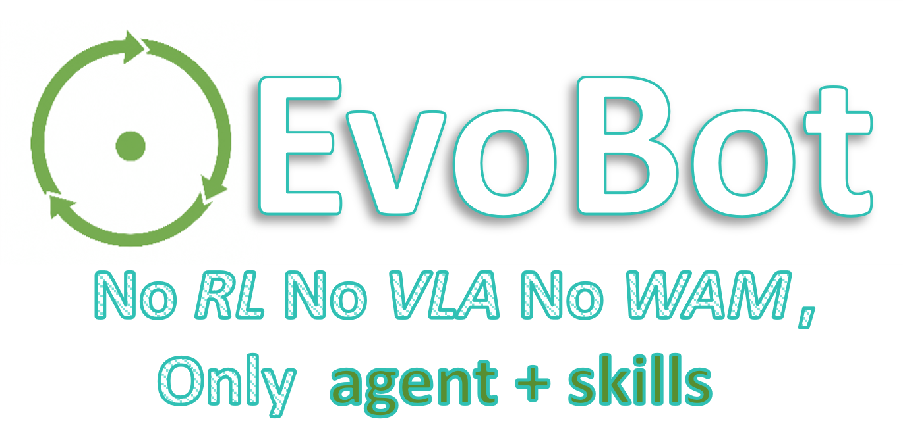

<div align="center">



# EvoBot

### Robot Manipulation with Agent + Skills. Nothing Else.

**No RL · No VLA · No WAM**

[](https://www.python.org/)
[](LICENSE)

[中文](README.md) · [Design Docs Index](docs/README.md) · [LIBERO Debug Notes](docs/12_libero_debug_2026-09-30.md)

</div>

---

## What is EvoBot?

EvoBot is a **self-evolving framework for robot manipulation**. It does **not** use reinforcement learning, vision-language-action models, or world models. It solves tasks with an **agent that composes reusable skills** and remembers what works—so it needs **fewer LLM calls and fewer attempts** over time.

It has two layers:

**Upper layer — self-evolution loop:**

| Component | What it does |
|-----------|--------------|
| **Skills** | Parameterized primitives + forged strategies the agent composes to solve tasks |
| **RAG Memory** | Injects past successes/failures into each decision; skips known-bad offsets, reuses known-good ones |
| **Evolution** | MAP-Elites search over configs; successful trajectories are distilled into code skills |

**Lower layer — manipulation capabilities:**

| Capability | What it does |
|------------|--------------|
| **IK Control** | CARTIK joint-space control for stable long-range motion (replaces unstable CARTIMP) |
| **Force Control** | `guarded_move`, `impedance_push`, `spiral_search` — terminated by `force_ee` sensor |
| **Visual Servoing** | `servo_align` — closed-loop alignment on reprojection error for final cm-level precision |
| **MuJoCo** | Physics engine providing environment, contact dynamics, ground-truth perception |

## The Problem It Solves

LLM-driven robot manipulation has three recurring costs:

1. **Token waste** — the LLM re-plans the same pick-and-place from scratch every episode.
2. **Repeated failures** — no memory of "grasping from this offset slipped last time," so the robot retries the same bad action.
3. **No generalization** — a policy learned on one object or robot rarely transfers to another.

EvoBot addresses all three by treating **experience as a first-class, queryable resource**.

## Design Docs

Sixteen module design docs under `docs/`. Writing conventions: each doc states only **facts readable from the code**, with `file:line` evidence for load-bearing claims, and each ends with an explicit "**verified gaps and limitations**" section that records where comments disagree with the implementation. Full index: **[docs/README.md](docs/README.md)**.

**robopal stack** (LLM decisions + RAG memory, 01–07):

| # | Doc | Highlights |
|---|-----|-----------|
| 01 | [RAG Memory](docs/01_rag_memory.md) | normalized offsets, failure TTL, semantic retrieval, UCB ranking, confidence upgrade |
| 02 | [Agent & Runners](docs/02_agent_runner.md) | the five-step loop, dispatcher-free design, candidate generation, retries |
| 03 | [Skills Framework](docs/03_skills_framework.md) | three-tier skills, SkillSpec metadata, control/motion/perception primitives |
| 04 | [Evolution System](docs/04_evolution_system.md) | MAP-Elites quality-diversity, skill_forge (design narrative) |
| 05 | [Robot Backend](docs/05_robot_backend.md) | RobotBackend ABC, YAML profiles, robot-agnostic decoupling |
| 06 | [LLM Integration](docs/06_llm_integration.md) | OpenAI-compatible protocol, structured output, rule-based fallback |
| 07 | [Perception](docs/07_perception.md) | YOLO/SAM/GraspNet, ground-truth path, full random-source survey, GPU non-determinism |

**LIBERO benchmark stack** (parses BDDL as a formal spec instead of guessing, 08–12):

| # | Doc | Highlights |
|---|-----|-----------|
| 08 | [Planning & Execution Stack](docs/08_libero_planning_stack.md) | BDDL→ordered subgoals, predicate→skill map, mechanism-driven replanning, attempt loop with dual-criterion timeout |
| 09 | [LIBERO Skills](docs/09_libero_skills.md) | `serve`/`goto` base, grasp candidate enumeration and 13 gates, `mem` dictionary, manifold following |
| 10 | [Physics Mechanisms](docs/10_physics_mechanisms.md) | 10 failure mechanisms and their discriminators, Θ-cut and geometric fallbacks |
| 11 | [Env Adapter](docs/11_envs_libero_adapter.md) | fixed initial states, horizon rewind, unified `servo_step` semantics, `AttemptStepLimit` |
| 12 | [Debug Notes 2026-09-30](docs/12_libero_debug_2026-09-30.md) | a full troubleshooting record: failure triage, the `turnon` endpoint bug, non-reproducibility investigation |

**Evolution / execution / memory / periphery** (13–16, implementation details behind 04–06):

| # | Doc | Highlights |
|---|-----|-----------|
| 13 | [Evolution (implementation)](docs/13_evolution_map_elites.md) | MAP-Elites binning and operators, forged-skill confidence upgrade, anchor reprojection |
| 14 | [Dynamic Execution](docs/14_dynamic_runner.md) | condition-driven skeleton, method library and selection, **the three mechanism-consumption paths** |
| 15 | [Memory & Cross-Process Learning](docs/15_memory_and_ipc.md) | RAGMemory v3 (episode clock/TTL/TF-IDF/UCB), ipc socket protocol and resume |
| 16 | [Outer Subsystems](docs/16_outer_subsystems.md) | LLM JSON contract and grounding validation, RobotBackend + mplib, benchmarks, weight mirrors |

## How It Works: The Self-Evolution Loop


**Before execution**, RAG filters out recently-failed grasp offsets and surfaces the best proven offset. **After execution**, the result is written back—successes become reusable strategies, failures become temporary pitfalls (TTL-based, not permanent).

### Skill hierarchy

```
Strategy Skills (forged, auto-generated from success)
        │  calls
Control / Motion Primitives (servo_align, guarded_move, path_plan, ...)
        │  calls
Perception Skills (detect, segment, grasp_pose)
```

## Two Parallel Stacks

The repo contains **two parallel stacks** that share lower-level skills and the physics-mechanism module but plan in opposite ways:

| | **robopal stack** | **LIBERO benchmark stack** |
|---|---|---|
| Entry | `darwin/agents/agent.py` + `runner_dynamic.py` | `darwin/agents/libero_runner.py` |
| Task source | static benchmark table / YAML | BDDL formal spec (parsed by `task_spec.py`) |
| Planning | LLM + RAG memory + method library, adaptive | **no guessing**: BDDL→ordered subgoals (stable topological sort) |
| Failure handling | mechanism-driven step/attempt parameter tuning, candidate blacklist | mechanism-driven replanning + `mem` dictionary |
| Timeout criterion | — | **simulation steps (deterministic)**; wall clock only as a backstop |
| Docs | 01–07, 13–16 | 08–12 |

## LIBERO Benchmark

Uses the [LIBERO](https://github.com/Lifelong-Robot-Learning/LIBERO) environments and task definitions, but drives them with the deterministic stack above (no LLM subgoal guessing).

```bash
# Single task (up to 30 attempts), via resident-sim IPC + reflection learning
PYTHONPATH=$PWD:/path/to/LIBERO MUJOCO_GL=egl python -u scripts/ipc_learn.py \
    libero_spatial:0 --max-attempts 30 --sock /tmp/libero.sock

# Run the agent runner directly (resumes from the ledger, skips passed tasks)
PYTHONPATH=$PWD:/path/to/LIBERO MUJOCO_GL=egl python -u -m darwin.agents.libero_runner \
    --suites libero_spatial,libero_object,libero_goal

# Full 30-task regression (acceptance script)
bash scripts/verify_30.sh 8 verify
```

**Status (2026-09-30)**: **23 of 30 tasks passing** (ledger `logs/libero_agent_progress.json`). This round fixed `goal:7` (`turn_on_the_stove`) — `articulation_info` used the max side of the joint range, demanding a target angle 3.6× LIBERO's success threshold; switching to the min side made the task pass on the first attempt. Full evidence chain and measurements: [docs/12](docs/12_libero_debug_2026-09-30.md).

> ⚠️ **Results are not fully reproducible yet**: re-running the same task from the same fixed initial state can change the verdict. Wall-clock timeout, CPU thread count, and RRT seed have been ruled out; the residual noise comes from GraspNet's GPU forward pass in perception (the unseeded global `np.random` is fixed; GPU-forward residue remains). See [docs/07](docs/07_perception.md) and [docs/12](docs/12_libero_debug_2026-09-30.md) §4.
>
> **When reporting pass rates: a single pass ≠ a stable pass.**

## Quick Start

### Install

Core package (RAG memory only, zero ML dependencies):

```bash
pip install -e .
```

Simulation and benchmark dependencies are listed in `requirements.txt` / `requirements-extra.txt`.

### Minimal usage

```python
from ragbot import RAGMemory

rag = RAGMemory()
feat = {"shape": "box", "size": [0.05, 0.05, 0.05]}

# Before action: learn from the past
best = rag.best_success("pick", feat)             # proven grasp offset
bad  = rag.is_failed("pick", feat, [0.2, 0, 0])  # did this fail recently?

# After action: write back experience
rag.add_success("pick", feat, rel_offset=[0.05, 0, 0], score_band="mid", attempts=2)
rag.add_failure("pick", feat, rel_offset=[0.2, 0, 0],  score_band="mid", fail_phase="descend")
rag.tick()    # advance failure-TTL clock
rag.decay()   # purge expired failures
```

### Run an evolution episode (simulation)

```bash
python scripts/run_evolution.py --task pickplace --episodes 20
```

## Architecture

```
ragbot/                  Public package — RAG memory (numpy + pyyaml only)
  memory/
    store.py             YAML-frontmatter store, evidence merge, confidence upgrade
    rag.py               normalized offset, TTL, semantic retrieval, UCB ranking
    experience/          seed experiences (.md, git-trackable)

darwin/                  Simulation & evolution harness
  agents/                ManipulationAgent (5-step loop), runner_dynamic,
                         libero_runner / libero_planner / libero_skills (LIBERO stack)
  skills/                base.py, primitives/, perception/, forged/, configs/
  evolution/             MAP-Elites, skill_forge, EvolutionLoop
  physics/               failure-mechanism discrimination, Θ-cut fallbacks, derives, posterior
  policies/              step-level decision points (retry params / rules / parameter spaces)
  memory/                darwin-side memory layer (fork of ragbot's)
  ipc/                   resident sim process + reflection learner + batch learner
  envs/                  LIBERO adapter
  robot/                 RobotBackend ABC + MujocoRobopalBackend + YAML profiles
  benchmarks/            static benchmark table + LIBERO dynamic factory + MAP-Elites search space
  llm/                   OpenAI-compatible client (Ark / OpenAI)
  utils/                 weight download, MuJoCo tree helpers, EGL recording

robopal/                 Robot manipulation library (local dev copy)
docs/                    module design docs (01–16) + planning/ (internal) + archive/ + source/ (Sphinx)
scripts/                 reproducible entry points + dev_probes/ (one-off probes, kept for evidence) + llm_prompts/
reports/                 rescued reports and ledgers
data/  experience/  figs/  assets/
```

### Directory Conventions

- `logs/`, `videos/`, `data/videos/`, `*.mp4`, `**/snapshots/` are **not tracked** (see `.gitignore`) — run artifacts.
- `reports/` keeps artifacts with lasting value (calibration reports, ledger snapshots).
- `docs/planning/` holds **internal plans/TODOs**, not design docs; the design docs are only the `docs/NN_*.md` set. `docs/archive/` holds earlier full design write-ups.
- `scripts/dev_probes/` holds **one-off diagnostic probes**, archived rather than deleted — evidence scripts cited by the docs (e.g. `probe_goal5_plate.py`) stay reproducible.
- `docs/source/` is robopal's Sphinx tree, unrelated to the module design docs above.

## Key Design Decisions

- **Normalized grasp offset** `rel_offset = (grasp − center) / half_size` — experiences transfer across objects of different sizes.
- **Failure TTL (20 episodes)** instead of permanent blacklisting — failures expire as the scene changes.
- **Skills fail with a mechanism, not a boolean** — a failing skill returns a mechanism (`friction_slip` / `contact_blocked` / …) which the runner consumes along **three paths**: step-level retry params, attempt-level config tuning, candidate blacklisting — instead of blind retrying.
- **Timeouts counted in simulation steps, not wall clock** — machine load cannot affect the verdict, so results are reproducible (wall clock is only a backstop for hard hangs).
- **CARTIK over CARTIMP** — robopal's CARTIMP is unstable; use IK + joint impedance with a force sensor for termination.
- **Dispatcher-free execution** — the agent holds `Dict[str, Skill]` directly; forged skills reuse primitives via `bind()`.
- **Robot-agnostic motion primitives** — `motion.py` calls only `env.backend`; adding a robot = one YAML profile (URDF robots) or one `RobotBackend` subclass.

## Extending

| Goal | What to do |
|------|------------|
| Add a URDF-based robot | Write `darwin/assets/profiles/<name>.yaml` |
| Add a ROS/SDK robot | Subclass `RobotBackend`, register it, add a YAML profile |
| Add a control primitive | Subclass `Skill` in `darwin/skills/primitives/` |
| Add a LIBERO skill | Add a function in `darwin/agents/libero_skills.py` and wire it into the predicate map (see [docs/08](docs/08_libero_planning_stack.md)) |
| Use a custom perception stack | Provide `{shape, size, center, rel_offset}` — `ragbot` needs no ML deps |

## License

MIT
