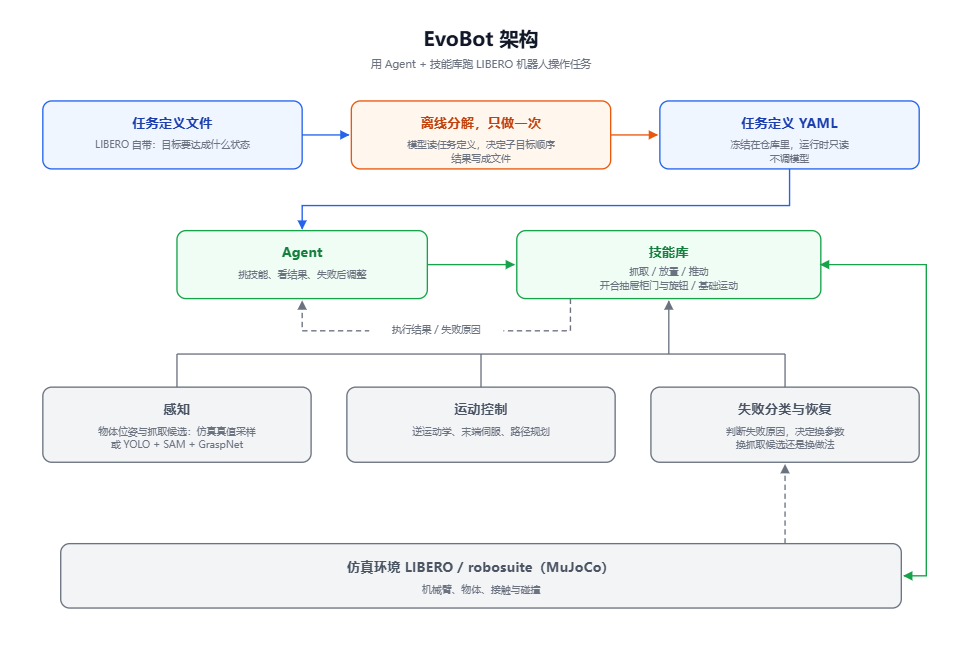

<p align="center">
  
</p>

<div align="left">

# EvoBot

**Agent + Skill: the Agent decides what to do and in what order, the skill library executes**

Across several rounds of iteration on the 30 tasks of the [LIBERO](https://github.com/Lifelong-Robot-Learning/LIBERO) benchmark, **83% (25 / 30)** now succeed.

No RL · No VLA · No world model · No LLM calls at runtime

[](https://www.python.org/)
[](LICENSE)
[](https://github.com/Lifelong-Robot-Learning/LIBERO)

[中文](README.md) · [Design Docs](docs/README.md)



<p align="center">
  
  <br>
  <sub>One complete episode: pick up the black bowl and place it on the plate
  (LIBERO <code>libero_spatial:0</code>, succeeded on the first attempt, 2965 simulation steps)</sub>
</p>

</div>

---

## What is this

EvoBot runs the LIBERO manipulation benchmark in two layers: **the Agent decides what to do and in what order; the skill library executes**. A skill is a reusable, parameterized action unit (grasping, placing, pushing, opening drawers and cabinet doors, turning stove knobs). When one fails it does not just report "failed" — it reports why (blocked, unreachable, slipped), and the Agent responds by changing parameters, trying another grasp position, or taking a different approach.

The order is not improvised at run time. Each LIBERO task ships with an official definition file; the framework parses it into structured data, lets a model order the subgoals **once, offline** (including whether a prerequisite like "open the drawer first" is needed), and commits the result as YAML. At run time it only reads that YAML — no model calls — so the same task always follows the same plan. The model can only reorder items and pick prerequisites from a given candidate list; it cannot rewrite goals, choose skills, or set parameters. Results are validated, and if validation fails the framework falls back to ordering derived from the dependency structure.

A trajectory is truncated by simulation steps rather than wall-clock time, so results do not depend on machine load; every task starts from a demonstration's initial state so runs can be compared.

## Results

Full evaluation over the 30 tasks of LIBERO's `libero_spatial`, `libero_object` and `libero_goal` sets: **25 / 30 pass** (each task run separately, up to 8 attempts each).

Reproduce with:

```bash
bash scripts/verify_30.sh 8 verify
```

## Design docs

| # | Doc | Contents |
|---|-----|----------|
| 01 | [Perception](docs/01_perception.md) | Where object poses and grasp candidates come from: ground-truth sampling vs. model inference |
| 02 | [Task Definitions & Planning](docs/02_task_and_planning.md) | Task definition → ordered subgoals → skill calls, and the one-off offline decomposition |
| 03 | [Skill Library](docs/03_skills.md) | The skill list and the common conventions |
| 04 | [Failures & Recovery](docs/04_failure_and_recovery.md) | Failure categories and how each is handled |
| 05 | [Environment Adapter](docs/05_env_adapter.md) | Uniform action interface, fixed initial states, keeping the environment from ending a task early, step-based truncation |
| 06 | [IK, Servoing & Motion Control](docs/06_ik_servo_motion.md) | How an end-effector target pose becomes joint actions |

## Requirements

- **Python 3.10** (conda env; 3.12 cannot run robosuite and its dependencies)
- **[LIBERO](https://github.com/Lifelong-Robot-Learning/LIBERO) source**, on `PYTHONPATH`
- MuJoCo + robosuite (as provided by LIBERO); set `MUJOCO_GL=egl` on headless machines
- Dependency lists: `requirements.txt` and `requirements-extra.txt` (video recording, trajectory planning)

```bash
conda create -n darwin python=3.10 -y && conda activate darwin
pip install -e .                        # install this project
pip install mujoco h5py numpy pyyaml    # base runtime dependencies
# install LIBERO and its dependencies per its own instructions, then:
export PYTHONPATH=$PWD:/path/to/LIBERO
export MUJOCO_GL=egl
```

## Quick start

```bash
# 1) Single task (resident sim process + step-by-step learning; up to 30 attempts)
PYTHONPATH=$PWD:/path/to/LIBERO MUJOCO_GL=egl python -u scripts/ipc_learn.py \
    libero_spatial:0 --max-attempts 30 --sock /tmp/libero.sock

# 2) Run the agent runner: reads the progress record and skips tasks that already passed
PYTHONPATH=$PWD:/path/to/LIBERO MUJOCO_GL=egl python -u -m darwin.agents.libero_runner \
    --suites libero_spatial,libero_object,libero_goal

# 3) Run all 30 tasks as acceptance
bash scripts/verify_30.sh 8 verify      # args: attempts per task, result tag
```

Useful flags:

| Flag | Default | Meaning |
|---|---|---|
| `--suites` / `--tasks` | `libero_spatial,libero_object,libero_goal` | which task sets to run, or an explicit `set:index` list |
| `--attempt-steps` | `7000` | per-trajectory simulation-step limit (the main stopping criterion) |
| `--attempt-timeout` | `300` | wall-clock limit in seconds (only fires if the process stops making progress) |
| `--no-video` | — | disable recording |

Per-task attempts are recorded in `logs/libero_agent_progress.json`, keyed as `libero:<set>:<index>`; tasks that already passed are skipped next time.

## Task definitions

Each task's definition is a self-describing YAML stored under `darwin/skills/configs/task_specs/`:

```yaml
language: put the bowl on top of the cabinet
source: llm                     # llm = decomposed by a model, deterministic = ordered automatically
formal:                         # the structured task definition
  items:                        # every condition the task requires, with a stable id
    - {id: p0, predicate: On, kind: place, object: akita_black_bowl_1,
       target: wooden_cabinet_1_top_side}
  implicit_candidates:          # prerequisites that may be inserted
    - {id: 'open:wooden_cabinet_1_top_side', predicate: Open, target: ...}
  vocabulary: {objects: [...], targets: [...], fixtures: {...}}
  skills: [...]                 # description of available skills
  reference_order: [...]        # order produced by automatic sorting, for comparison
llm:                            # raw record of this decomposition
  order: [p0]
  add: []
  rationale: Placing the bowl on top of the cabinet needs no door or drawer opened.
subgoals: [...]                 # the result, consumed directly by the runner
```

**Regenerate** (needs `DEEPSEEK_API_KEY`; without it, falls back to automatic ordering):

```bash
python scripts/gen_task_specs.py                     # all 30 tasks
python scripts/gen_task_specs.py --tasks libero_goal:7
python scripts/gen_task_specs.py --no-llm            # automatic ordering only
python scripts/gen_task_specs.py --model deepseek-v4-pro --force
```

## License

Apache-2.0 — see [LICENSE](LICENSE).
