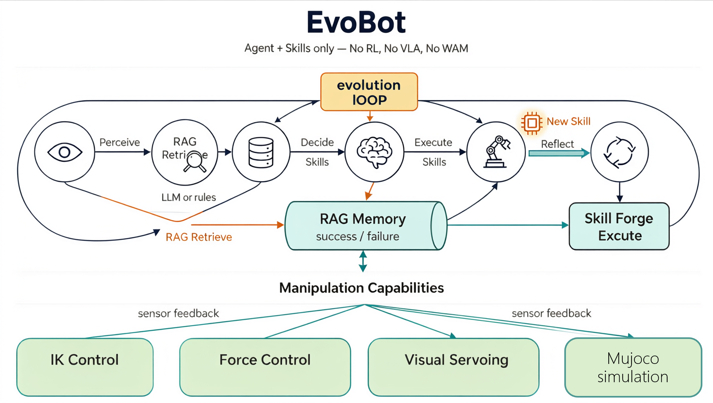

<br />

# EvoBot

机器人操作，只靠 Agent + Skills

**不用 RL · 不用 VLA · 不用 WAM**

[](https://www.python.org/)
[](LICENSE)

[English](README.en.md) · [架构文档](docs/)

***

## 这是什么

EvoBot 是一个面向**机器人操作**的**自进化框架**。它**不**使用强化学习、视觉-语言-动作模型或世界模型，只用 **Agent 组合可复用技能** + 记忆，从每次执行中学习——从而**需要的 LLM 调用更少、尝试次数更少**。

框架分两层：**上层 — 自进化循环：**

| 组件                | 做什么                            |
| ----------------- | ------------------------------ |
| **技能（Skills）**    | 参数化原语 + 自动生成的策略，Agent 组合它们完成任务 |
| **RAG 记忆**        | 每次决策前注入历史成功/失败；跳过已知坏偏移，复用已知好偏移 |
| **进化（Evolution）** | MAP-Elites 搜索配置；成功轨迹蒸馏为代码技能    |

**底层 — 操作能力：**

| 能力         | 做什么                                                                |
| ---------- | ------------------------------------------------------------------ |
| **IK 控制**  | CARTIK 关节空间控制，长距离运动稳定（替代不稳定的 CARTIMP）                              |
| **力控**     | `guarded_move`、`impedance_push`、`spiral_search`，由 `force_ee` 传感器终止 |
| **视觉伺服**   | `servo_align` — 基于重投影误差闭环对齐，实现最后厘米级精度                              |
| **MuJoCo** | 物理引擎，提供环境、接触动力学、真值感知                                               |

解决什么问题：

LLM 驱动的机器人操作有三个反复出现的成本：

1. **Token 浪费** — LLM 每个 episode 都从零重新规划同一个抓取放置任务。
2. **重复失败** — 没有"这个抓取偏移上次打滑了"的记忆，机器人反复重试同一个坏动作。
3. **无法泛化** — 在一个物体/机器人上学到的策略很难迁移到另一个。

EvoBot 将**经验视为一等的、可查询的资源**，从根本上解决这三个问题。

## 如何工作：自进化闭环

**执行前**，RAG 过滤近期失败的抓取偏移，给出最佳已验证偏移；**执行后**，结果写回——成功变成可复用策略，失败变成临时陷阱（TTL 过期，非永久拉黑）。

技能分层

```
策略技能（forged，由成功轨迹自动生成）
        │  调用
控制/运动原语（servo_align, guarded_move, path_plan, ...）
        │  调用
感知技能（detect, segment, grasp_pose）
```

## 快速开始

### 安装

核心包（仅 RAG 记忆层，零 ML 依赖）：

```bash
pip install -e .
```

### 最小示例

```python
from ragbot import RAGMemory

rag = RAGMemory()
feat = {"shape": "box", "size": [0.05, 0.05, 0.05]}

# 执行前：从历史学习
best = rag.best_success("pick", feat)             # 已验证的抓取偏移
bad  = rag.is_failed("pick", feat, [0.2, 0, 0])  # 这个偏移近期是否失败过

# 执行后：写回经验
rag.add_success("pick", feat, rel_offset=[0.05, 0, 0], score_band="mid", attempts=2)
rag.add_failure("pick", feat, rel_offset=[0.2, 0, 0],  score_band="mid", fail_phase="descend")
rag.tick()    # 推进失败 TTL 时钟
rag.decay()   # 清理过期失败记忆
```

### 运行进化循环（仿真）

```bash
python scripts/run_evolution.py --task pickplace --episodes 20
```

## 架构

```
ragbot/                  公开包 — RAG 记忆层（仅 numpy + pyyaml）
  memory/
    store.py             YAML frontmatter 存储、evidence 合并、置信度升级
    rag.py               归一化偏移、TTL、语义检索、UCB 排序
    experience/          种子经验（.md，可 git 追踪）

darwin/                  仿真与进化验证框架
  agents/                ManipulationAgent（五步闭环）、EpisodeRunner
  skills/                base.py、primitives/（control、motion）、perception/、forged/
  evolution/             MAP-Elites、skill_forge、EvolutionLoop
  robot/                 RobotBackend 抽象 + MujocoRobopalBackend + YAML profiles
  llm/                   OpenAI 兼容客户端（方舟 Ark / OpenAI）、规则回退
```

关键设计决策

- **归一化抓取偏移** `rel_offset = (抓取点 − 中心) / 半尺寸` — 经验可跨不同尺寸物体迁移。
- **失败 TTL（20 episodes）** 而非永久拉黑 — 场景变化后失败记忆自动过期。
- **CARTIK 替代 CARTIMP** — robopal 的 CARTIMP 不稳定；改用 IK + 关节阻抗 + 力传感器做终止保护。
- **去分发执行** — Agent 直接持有 `Dict[str, Skill]`；forged 技能通过 `bind()` 复用原语。
- **机型无关的运动原语** — `motion.py` 只调 `env.backend`；加新机型 = 一个 YAML profile（有 URDF）或一个 `RobotBackend` 子类。

扩展

| 目标            | 做法                                                            |
| ------------- | ------------------------------------------------------------- |
| 新增有 URDF 的机型  | 写 `darwin/assets/profiles/<name>.yaml`                        |
| 新增 ROS/SDK 机型 | 继承 `RobotBackend`，注册，加 YAML profile                           |
| 新增控制原语        | 在 `darwin/skills/primitives/` 继承 `Skill`                      |
| 接入自定义感知栈      | 提供 `{shape, size, center, rel_offset}` —— `ragbot` 无需任何 ML 依赖 |

