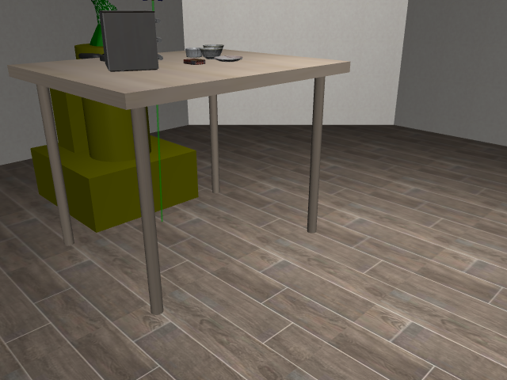
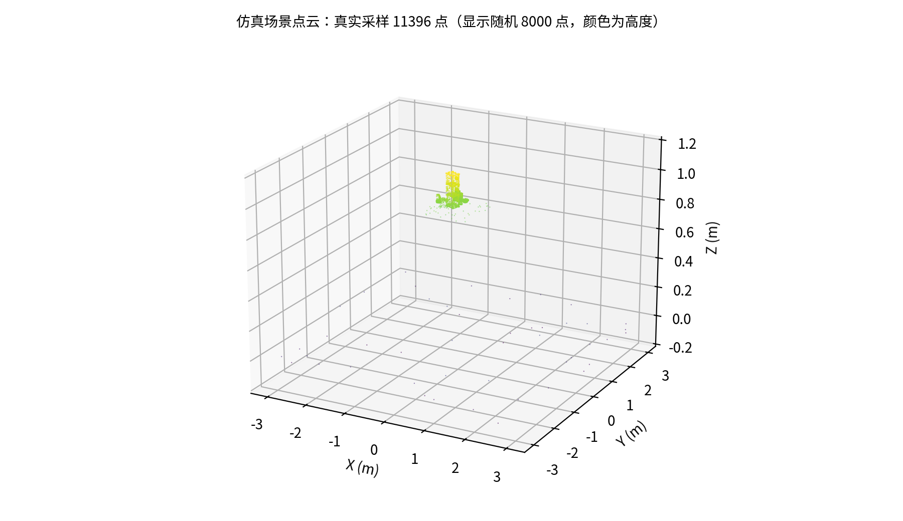
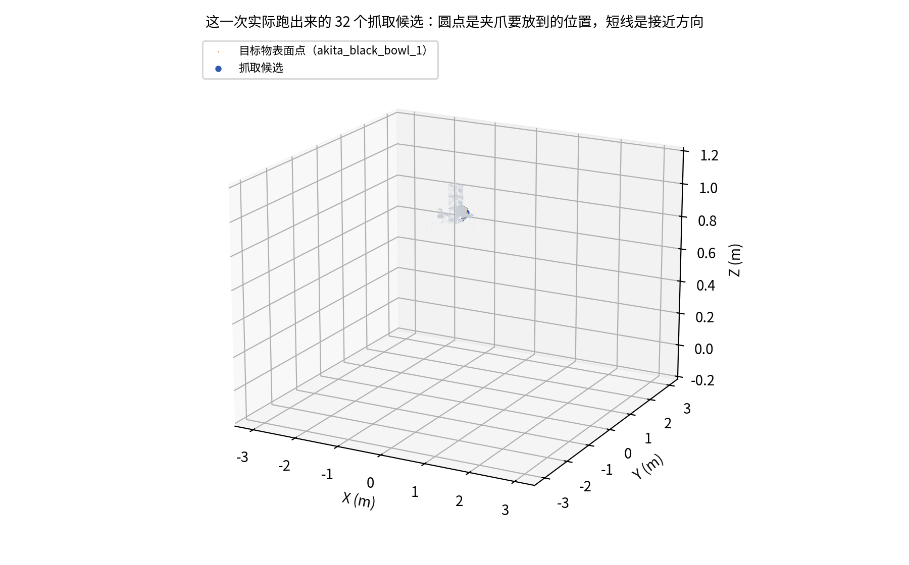

  

# 机械臂感知模块

**Agent + Skill：Agent 决定做什么、按什么顺序做，技能库负责执行**

在 [LIBERO](https://github.com/Lifelong-Robot-Learning/LIBERO) 基准的 30 个任务上经过多轮迭代，成功率 **83%（25 / 30）**。

不用强化学习 · 不用视觉-语言-动作模型 · 不用世界模型 · 运行时不需要调用大模型

  
   
  一个完整回合：抓起黑碗，放到盘子上（LIBERO <code>libero_spatial:0</code>，第 1 次尝试成功，2965 个仿真步）

---

## 这个模块解决什么问题

整个项目做的是机械臂的抓取与放置：给一句话描述的目标（比如"把碗放到盘子上"），让它自己拆成动作序列做出来。感知模块负责其中**最前置的一步**——机械臂动手之前，必须先知道三件事：**东西在哪、从哪个方向夹、夹多宽**。

这三件事是三件不同的事。位置只是一个点；抓取还需要朝向（手掌朝哪、手指从哪一侧合拢）；开合宽度要看物体的局部形状才能定。所以**知道物体在哪，不等于知道该怎么抓**——就算给一个精确到小数点后四位的坐标，也仍然不知道该夹杯身还是捏杯口。这就是为什么即便在没有感知误差的仿真里，也仍然需要一个专门的抓取模型。

## 它在整个系统里的位置

系统的分工是「Agent + 技能库」：Agent 决定做什么、按什么顺序做，技能负责把每个动作真正执行完。

感知在其中被做成**一类技能**，而不是一个前置的数据处理环节。它可以单独调用（比如只做检测），也可以组合成「检测 → 分割 → 抓取」的链路。这么做的直接好处是**它成为最容易被替换的一层**——换一套检测网络，Agent 和技能库不用改一行；核心代码不依赖任何具体模型。

## 先把几个说法讲清楚

后面会反复用到几个词。它们其实是一路问下来的，我按这个顺序交代。

先说**位姿**。机器人要动手，得知道东西在哪；但"在哪"只给了一个点。真正描述一个物体在空间里的状态，除了位置还得有朝向——杯子是立着还是倒了、手柄朝哪边。位置加朝向，才叫位姿。抓取也一样：抓取不是一个点，而是一个位姿，说明爪子停在哪、朝哪个方向伸过去。

那这些位姿从哪来？从**点云**。把物体表面采成一堆带三维坐标的点，就是它了。这里有个容易忽略的地方：为什么不用相机图像？因为图像是投影，尺度在投影里丢了——同一张图，可能是近处的小杯子，也可能是远处的桌子。所以抓取这一步吃的是点云，不是图像。

再说**抓取候选**。一次感知给出的不是一个抓取，而是一批。每个候选包含几件事：爪子落在哪个点、朝哪个方向伸过去、张开多少；另外每条还带一个**置信度**，也就是模型对它有多大把握，用来排序，把握大的先试。

最后是**网格与包围盒**。这一对的区别，后面讲采样时会很关键：仿真里的物体常常同时有两套描述——网格是它真正的形状，哪儿是弯的、哪儿是空的；包围盒只是一个长方体，只说明这个物体占了多大范围。一个描述形状，一个描述范围。

## 四个主要选择

这个模块的四个主要选择不是并列的口号，而是一条链子：每一个都是在上一个的前提下才必须做的决定，而且每条都带着代价。

**第一，先问环境能提供什么，再选算法。** 起点是信息质量不一样：仿真里物体的位置和形状是直接读出来的精确值，真实场景里只能从图像估计。如果不管来源都走同一条路，等于拿有误差的量去替换本来就精确的量。所以我把入口分成两条——环境能给真值就走真值，只有图像才去推理。代价是代码里有两套入口要各自维护，而不是一条能通用的流水线。

**第二，既然两条路的输出都不够准，那就别追求"一个最优解"。** 无论位置来自真值还是估计，抓取位姿本身都很难算准：它对物体的形状、摩擦、接触状态都敏感，同样的位置换个摩擦系数，就可能从夹住变成滑脱。与其把赌注压在一个"最优解"上，不如一次产出一批候选，把判断往后推。代价是后面必须配一套筛选机制，而且每次尝试都要留出试错的预算。

**第三，筛选不能只靠几何，关键一步要用物理预演。** 候选有了，接下来要判断哪个能行。几何能回答"这个位姿手臂够不够得到"，但回答不了"真的夹住了没有"——爪子合拢的瞬间可能正好从边上滑过去。所以最后一关我让仿真真合一次爪子，看它到底碰到了什么。这笔开销在仿真里几乎可以忽略，换成真机就是一次白试。

**第四，上面三条要成立，感知就不能被某一个模型锁死。** 前三条都建立在"能拿到位姿、能给出候选"之上，而感知模型是迭代最快的一层——今天用这套检测，明天可能整套换掉。所以我把感知做成一类技能，核心代码不依赖任何具体模型。代价是多了一层间接：模型自己的特殊能力不会自动漏给上层，要用什么得显式接出来。

## 两条感知路径

走哪条**由环境能提供什么决定**，不由任务配置决定，两条不能混用——这正是上面第一个选择的直接结果。

**仿真真值路径。** 环境能直接给出物理模型时，物体的位置和形状都是已知量。这条路不渲染图像、不跑检测，直接取几何采样成点云，再交给抓取网络。用图像去估计，等于用有误差的量替换精确的量。基准测试和需要精确位姿的实验都走这条。

**模型推理路径。** 只有相机图像时就必须从图像出发：先用 YOLO 检测框出物体（置信度阈值我设在 0.25），再用 SAM 抠出轮廓，在轮廓内取深度换算成三维坐标，最后交给抓取网络。真实机器人、以及只给图像快照的第三方环境走这条。

两条路径的出口是同一种东西：一组带位置、朝向、开口宽度的抓取候选。再往下的处理完全一样。

## 抓取候选是怎么来的

这一步分三个串行的阶段：先采样，再生成，最后筛选。

**采样：为什么送整幅场景的点云。** 送入网络的是**整幅场景**的点云，不是目标物体自己的。我一开始只送目标物体，网络看不见桌面、柜架、盘子边缘这些支撑几何，会给出一个看着合理、实际和支撑面互相干涉的抓取。送入前统一重采样到两万点上下，场景里每个几何体固定采 64 个。

采样里有两个细节是踩过才知道的。其一，**形状精确的物体要从网格顶点取点**——它的包围盒只说明占多大范围，在里面撒点得到的是一个虚胖的方块，不是那个物体。其二，**纯视觉外壳要跳过**——仿真里有些几何体只负责"看起来像"（比如容器的外观壳），它记录下来的尺寸是外壳本身的大小，并不代表里面的真实形状，照它采样会把容器内腔填满、点云里多出一坨不存在的实心；但要小心，有些物体的真实形状恰好只挂在视觉网格上，那就必须保留。

**生成：两个来源交替出候选。** 候选有两个来源，交替产出：抓取模型直接预测一批（按置信度取前 64 个；如果落在目标物上的一个都没有，就翻页放宽到 256 个），几何方法再直接构造一批（沿容器口沿深捏、从侧面外夹，最多试 12 个）。

为什么交替，而不是把网络的试完再试几何的？因为网络候选里常常夹着一长串不可用的解，挨个穷举很可能预算用完都轮不到几何解。

还有一处坐标系要转：网络是在相机坐标系下训练的，在相机系里"向场景内"才是物理上的接近方向；而仿真点云是世界坐标系。所以送入前要变换一次、预测后再变回来。搞错不会报错，只会表现成"成功率莫名其妙很低"。

**筛选：六道关，最后一道最关键。** 候选要过六道关才会被执行：开口宽度不超过夹爪能张开的范围；抓取点落在物体中上部，免得指尖探下去撬翻它；候选确实落在目标物体上；那个位姿手臂不会自撞、也不会撞到别的东西；从预备位到抓取位的下探路上逐点无碰撞；最后用仿真预演一次闭爪。

最后一道最关键：**能到达不等于夹得住**——前五关全过了，爪子也可能在合拢瞬间从边上滑过去。通过的候选按签名去重，失败过的下一轮跳过。

## 调试过程中踩过的问题

**第一是送进去的点云质量问题。** 只送目标物体会撞桌子、包围盒撒点会虚胖、视觉外壳会填满内腔——三个坑都在同一件事上：点云的质量决定候选的质量，网络本身没问题。麻烦之处是它不报错，只是成功率偏低，得把点云画出来看才能发现。

**第二是候选穷举的顺序问题。** 一开始把网络候选全试完再试几何候选，结果预算都耗在网络的废解上。改成交替产出后，同样预算下成功率明显不一样。这让我意识到：候选排列顺序和候选质量同样重要。

**第三是几何不一致导致的静默失败。** 有些物体的网格尺寸和碰撞尺寸不一致，拿几何中心当物体中心会偏，也是靠把点云画出来才定位到的。
