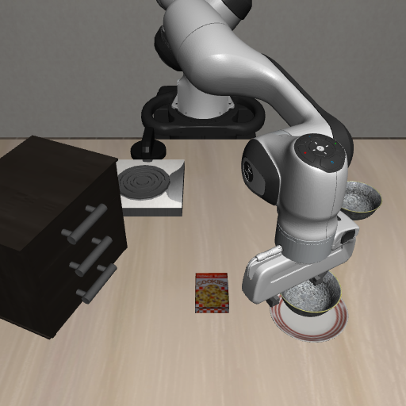

  

# 任务定义与规划

**Agent + Skill：Agent 决定做什么、按什么顺序做，技能库负责执行**

在 [LIBERO](https://github.com/Lifelong-Robot-Learning/LIBERO) 基准的 30 个任务上经过多轮迭代，成功率 **83%（25 / 30）**。

不用强化学习 · 不用视觉-语言-动作模型 · 不用世界模型 · 运行时不需要调用大模型

  
   
  一个完整回合：抓起黑碗，放到盘子上（LIBERO <code>libero_spatial:0</code>，第 1 次尝试成功，2965 个仿真步）

---

## 项目背景

这个项目用「Agent + 技能库」跑机器人操作任务：给一句话描述的目标，Agent 决定做什么、按什么顺序做，技能库把每个动作真正执行完。我负责其中的**任务定义与规划模块**。

要解决的问题很靠前：**一句话的目标，怎么变成一串有序的子目标**。"打开顶层抽屉并把碗放进去"里，机器人其实要做两件事，先拉开抽屉，再把碗放进去，顺序不能反。规划层的职责就是先拿到这个有序列表，再把每一项翻译成技能调用，交给技能库。

有一条认知我从一开始就定下来：**不要让模型去猜目标**。这个基准里每个任务都自带一份官方定义文件（一种谓词式的描述格式，缩写为 BDDL），写清了最终要达到什么状态，例如"碗在抽屉里""抽屉是打开的""炉灶是点着的"。目标既然已经给定且精确，再让模型重述一遍，就是用可能出错的过程去近似一个本来正确的答案。所以我做的不是让模型理解任务，而是把这份定义解析成结构化数据：取出其中的谓词、对象名、目标名，变成程序能直接消费的形式。

规划层**不关心任务叫什么名字**，只关心要达到哪些状态、这些状态之间有什么物理先后关系。这条原则决定了它能做成通用流程，而不是一堆任务特判。它夹在感知和技能库之间：感知回答"东西在哪、怎么抓"，技能库负责把每个动作做到位，规划回答的是中间那个问题——目标之间是什么关系、该按什么次序完成。这个位置决定了它的产物必须是确定的，计划每次都变的话，后面再准再稳也谈不上复现。

## 整体上的几个取舍

**第一，把不确定性挡在离线和运行期之间。** 模型只在离线跑一次、产物冻结，运行期完全确定。需要判断力的部分交给模型，需要复现性的部分交给代码。

**第二，给模型自由，但不给它创造的自由。** 只允许它在给定集合内排序、在给定候选内挑选，不允许造目标、挑技能、给参数。输出因此天然可校验，"模型到底帮上忙没有"也变成可度量的问题。

**第三，任务定义描述终态，执行顺序描述过程。** 两者之间隔着物理前提，"该补哪些前置动作"要显式整理成候选，不能指望模型自己想。

**第四，失败要给机制，不要只给布尔值。** 只说"失败了"，上层除了重试什么也做不了；给出原因，才能决定换候选、换实现还是收尾。

**第五，计划和执行分开归档。** 计划是一份冻结快照，执行是一轮轮尝试记录。"计划对不对"和"这次执行顺不顺"因此可以独立回答，排查时互不干扰。

## 模型只在离线阶段出场一次

决定子目标顺序这一步，最容易想到的做法是运行期每次执行前让模型现场排序。我把它挪到**离线一次性完成**：模型做两件事，排列执行顺序，决定要不要插入"先开抽屉"这类前置动作；结果冻结成一份 YAML 提交进仓库，运行期只读文件、完全不调用模型。

好处有三条。同一个任务每次跑出来的计划完全相同，不受采样随机性影响；运行期零 token 消耗，评测 30 个任务（三个任务集各 10 个）时不会因为反复规划而花钱；执行失败时不用纠结是计划错了还是执行错了——计划固定可复现，问题要么在计划本身（离线一次就能查），要么在执行环节，责任分得清。

## 结构化任务定义与冻结产物

生成脚本把原始定义物化成模型和校验器都能读的数据，有四块内容：全部子目标谓词，每项一个稳定编号（`p0`、`p1`），这些是任务的全部要求，不可增删；允许插入的前置动作候选，比如往抽屉里放东西前先打开它；词表，列出出现的对象名、目标名，以及每个可动夹具能不能开合、是不是炉面；一份由确定性排序算出来的**参考顺序**。另有一份谓词类别与技能类别的对应说明，只做声明，不参与执行。

原始定义是给人看的，模型需要的是边界清楚、可校验的输入。把"能做什么、不能做什么"提前固化成数据，校验器才能逐条检查模型回复，而不是靠事后肉眼比对。

冻结的 YAML 保留三层信息：这次分解的结果，即执行器消费的有序子目标；**依据**，即上面那份结构化定义，说明排序是在什么范围内做的；**记录**，即这次是谁、按什么理由排的，包括模型名、它给出的顺序、选择插入的前置动作和一句话理由。再加一个来源标签，标明这份文件来自模型分解还是自动排序。任何一个任务的计划看着不对，打开文件就能看到依据、排法和有没有插入前置动作——计划被冻结，但它不是黑盒。

## 模型的权限边界与校验

模型的自由度被压到最小，因为它这里需要的是常识性排序，不是创造性。

能做两件事：输出执行顺序，且必须恰好是给定子目标的一个排列，不重不漏；从给定候选前置项里原样照抄要插入的那些，不需要就留空。不能做三件事：不能新增、删除或改写任何目标、对象名、目标名；不能自己决定用哪个技能；不能给技能参数。

`validate_order()` 逐条检查编号是否已知、是否重复、是否漏项、前置是否只从候选里挑。校验不通过，或者模型不可用（缺密钥、网络异常、返回内容解析不了），就退回自动排序并把原因写进文件。生成脚本因此**永远能产出一份可用的任务规范**，失败也有迹可查。

## 自动排序：备用路径与对照基准

自动排序是"依赖关系 + 原文顺序"的稳定排序：每轮从没有未满足依赖的节点里取原文序号最小的那个。依赖边只针对放置类子目标建立——同一个夹具上，打开排在放进去之前，放进去排在关闭之前；放的目标是炉面时，点火也排在它之前。如果定义里没写打开、而目标又是往抽屉、柜子、微波炉里放东西，就自动补一个标注为隐式的前置动作。暂不支持的谓词不参与排序，只记录下来。

它只认事先写死的那几条物理依赖，超出这些关系的顺序表达不了，所以没被当成唯一方案。它保留三个角色：模型不可用时的**备用路径**、模型输出的**校验依据**、写进文件的参考顺序。第三条最重要——它让模型的价值可以被度量，而不是靠感觉说"模型排得挺好"。

## 子目标到技能：与任务名无关

`plan_subgoal()` 只做"目标类别到技能"的映射：`On` / `In` 这类放置目标映射成"抓取 → 放到目标"两个技能；`Open` / `Close` 开合目标映射成一次开合技能，方向由谓词决定；`Turnon` / `Turnoff` 开关目标映射成一次旋钮技能；其余暂不支持的谓词映射成空序列，执行器记录后跳过。

规划器不知道"这是第几个任务""任务叫什么"。一旦按任务名写特判，评测里每加一个任务就要改一次规划器，这类特判没法推广。映射只依赖谓词类别，新增任务只要目标谓词落在已有类别里，规划器一行都不用改。

规划停在子目标这一层，是因为两层的信息需求不一样：子目标只依赖任务定义，静态、可离线确定；技能怎么执行、失败之后怎么换参数，依赖运行期的真实状态，只能在线上决定。切开之后各自都简单。执行每个子目标之前还会先检查它是不是**已经满足**，满足就跳过，标准与基准自己的成功判定一致，这样重试是从当前状态继续，而不是把已做好的事从头重跑。

## 运行期链路

*第 1 次尝试的第 2940 步：子目标已达成，碗已经在盘子上。*

运行期拿到冻结文件后，`libero_runner` 把整件事串起来。单个任务默认最多尝试 8 次，每次从同一个固定初始状态重来；单条轨迹内先按子目标顺序推进，每个失败的子目标交给规划器按机制重试，最多 4 轮重规划。

单条轨迹有两个上限：仿真步数默认 7000，实际耗时默认 300 秒。我把**步数当主标准、实际耗时当备用**——步数只跟执行到哪一步有关，跟机器当时忙不忙无关，同一个初始状态跑出来的结果才可复现；耗时只在进程没在走步却卡住时才可能先触发。7000 不是拍脑袋定的：已观测到的失败轨迹最多一千多步，取到七千留了余量，又能让正常的失败尝试在一分钟出头的仿真时间内被截断。

任务之间串行：一个任务确认通过之后才启动下一个。评测要的是每个任务独立的结果，任务之间不共享状态，串行既避免相互干扰，也让每个任务的失败可以单独定位。每个任务的尝试过程和每一轮子目标推进都记进进度记录文件，重跑时自动跳过已通过的任务——**中断之后不用从头再来**，已经通过的不会重复消耗时间。

## 失败之后：先处理机制，再谈重试

技能失败时返回的**不是一个布尔值，而是一个原因**，例如没夹住、被挡住、够不到、没有可用的抓取候选。布尔值只告诉我这步没过，原因才告诉我下一步该换什么。`replan_hint()` 把原因映射成下次执行的参数：不好夹或够不到就换下一个几何抓取候选；别的机制就认为世界已经被刚才的动作改变，用新的感知结果重跑同一个子目标。子目标前面失败得越多，换到的候选越靠后。

有一类单独处理：某个放置目标反复抓取失败，原因明确是"没有可用的抓取候选"。这不是执行失误，而是几何上的事实——这个物体的抓取空间在这个位姿下确实穷尽了。`plan_subgoal_alternative()` 换一种物理上的做法，直接去推或拨，把物体送到位。同一个目标的两条实现路径，仍然与任务名无关。

## 任务定义变了要重新生成

冻结文件只在任务定义不变时有效。上游定义改了、或者想换一个模型重新分解，就重跑生成脚本：默认把三个任务集共 30 个任务全部重新生成，`--tasks` 指定单个任务（例如某个任务集里的第 8 个），`--no-llm` 完全不调模型、只写出确定性规格；默认不覆盖已存在的文件，需要覆盖时显式加 `--force`。分解时采样温度取 0。

脚本逐条打印每个任务的来源（模型分解还是自动排序）、它排出的顺序是否与参考顺序不同、最终的子目标序列，末尾汇总成功数、不一致数和回退数。**"与参考顺序不同"这一列是我最常看的**，它是判断模型有没有带来信息量的最直接指标。

## 调试过程中踩过的问题

**第一个是模型输出"看起来合法"。** 一开始觉得让它排个序很简单，实际跑下来它偶尔漏掉一个目标、把某个编号写两遍、甚至临时编造一个编号。麻烦在于这种输出长得很正常，顺序看着合理，但列表根本不是原来那些目标。所以校验成了先决条件：任何一项对不上，宁可退回自动排序，也不接受一份"看起来对"的结果。**规划层错一个目标的代价是整条轨迹白跑，比多花一次确定性排序贵得多。**

**第二个是隐式前置动作。** 定义里写的是"碗在抽屉里"，但机器人不能直接往关着的抽屉里放东西。我一开始没处理，模型也经常想不起来要加。后来把"允许插入的前置动作"主动整理成候选交给模型，自动排序里也补上同样的逻辑，两条路径行为一致。**任务定义写的是终态，执行顺序依赖的是过程中的物理前提，这两件事不是一回事。**

**第三个是替代路径的空转。** 推或拨这条路一开始接在重试循环里，失败了就按一般机制重试。但它只有一条实现、不接受换候选的参数，后面每一轮在参数上是逐字重复，白白耗掉剩下的轮次。改成失败一次就直接收尾并上报真实原因后，省下了四分之三的执行时间，也避免把"几何上做不到"伪装成"轮次用完了"。

**第四个是"执行完了"和"目标达成了"不一致。** 有一轮技能全部执行完、没有任何报错，最后复核时却发现目标状态并没有真正成立。我因此专门加了一道检查：技能即使成功返回，也要再用状态判定复核一次子目标，避免把"跑完了"当成"做到了"。
