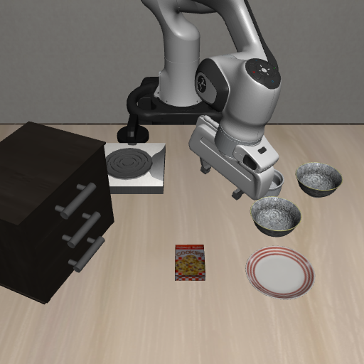

  

# 技能库

**Agent + Skill：Agent 决定做什么、按什么顺序做，技能库负责执行**

在 [LIBERO](https://github.com/Lifelong-Robot-Learning/LIBERO) 基准的 30 个任务上经过多轮迭代，成功率 **83%（25 / 30）**。

不用强化学习 · 不用视觉-语言-动作模型 · 不用世界模型 · 运行时不需要调用大模型

  
   
  一个完整回合：抓起黑碗，放到盘子上（LIBERO <code>libero_spatial:0</code>，第 1 次尝试成功，2965 个仿真步）

---

## 项目背景

这个项目用「Agent + 技能」的方式跑机器人操作任务：给一句话描述的目标，Agent 负责拆子目标、决定顺序，技能库负责把每个子目标执行完。技能库是系统的主体，我在这里花的时间最多。

一个技能就是一个可复用、带参数的动作单元——「伸手到某处」「把杯子拿起来」「把抽屉拉开」。输入是环境适配器加参数，输出是执行结果。它不判断任务完成没有，也不决定先做哪一步。库里没有按任务写死的数值，出现的数字只有四类来源：模型的几何与关节限位、执行时在线测出的量、求解器自身的精度参数、统一的统计约定。这条约束我一直守着，它决定了技能能不能跨物体、跨任务复用。

边界划在这里，是因为"任务完成没有"和"这个动作做成没有"是两件事。技能看得见的是物理世界：手到没到、夹住没有、物体动没动；任务完成与否要看几个物体之间的关系，需要把多个子目标合起来判断。两边混在一起，技能就会长出针对具体任务的判断，复用性立刻没了。所以技能里连"下一步做什么"都不写，失败分类也只描述物理事实。

## 整体上的几个取舍

**第一，失败要给原因，不能让调用方猜。** 一个布尔值只能换来原样重试，一套分类才能换来不同处置。技能只报告发生了什么，重试策略留在外面。

**第二，到位靠残差，不靠步数。** 接触附近的位移和噪声是一个量级，写死的距离和步数都不稳。把"进入噪声范围"当作到达更可靠。

**第三，抓取先产出一批候选，再逐道筛。** 抓取位姿本身就算不准，与其追求最优解，不如承认不确定性，用几何和物理条件一批批筛掉明显不行的。

**第四，抓不动就换物理实现，而不是硬撑。** 同一个放置目标，推和放是两条路。候选被几何事实耗尽时退回推，是规划意义上的正常分支。

## 统一约定

签名都是 `skill(adapter, ...参数..., mem=None)`：`adapter` 是技能读模型、读观测的唯一入口；`mem` 是可选记忆字典，用来在同一个子目标的多次尝试之间保留状态。返回统一是字典，成功是 `{"success": True, "measures": {...}}`，失败是 `{"success": False, "reason": ..., "mechanism": ..., "measures": {...}}`——`reason` 给人看，`mechanism` 给程序看，`measures` 是数值细节；只有 `serve` 和 `goto` 成功时返回空。

失败分成几类给程序用：`ik_unreachable` 是够不到或被挡，标准响应是换一个抓取候选；`contact_blocked` 是被物理阻挡，说明世界已被这次动作改变，应按现状重跑；`action_fail` 是手和物体失去接触，动作没作用到物体上；`no_candidate` 是候选全部试过仍不行，这是几何事实，对应换物理实现；`timeout` 是预算用完；`wrong_state` 是前置状态不满足；`perception_fail` 是目标名或关节信息解析不出来。失败后要不要重试、试几次，一概不写进技能内部。

## 基础运动

最底下是 `serve`：闭环一步步微调控制指令，让末端持续朝目标靠近，给了目标姿态就同时伺服姿态。到位的标准不是走了多少步，而是残差进入误差范围——位置残差不大于 3 毫米和 3 倍在线估计的末端噪声这两者的较大值，姿态残差不大于约 0.05 弧度。这个跟着噪声走的阈值是有意的：接触附近会持续微颤，写死一个距离要么太松、要么永远进不去。`goto` 在它外面套一层，给了容差就构造几何复核条件交给它。

`serve` 刻意不设步数上限，因为慢而持续的进展应该走完，硬截断会把接近接触的最后几毫米截断，而那几毫米决定夹住还是擦过。不卡死靠统计：每 30 步做一次窗口回归看末端距离是否在缩小，连续三个窗口没进展时再按物理证据分类——接触力超出背景 3 倍噪声报 `contact_blocked`，关节几乎不动报 `ik_unreachable`。只有调用方显式传入预算时才用步数截断。

底座之下还有路径工具：`corridor_plan` 把一段位移拆成多条腿逐条走，`plan_arm_path` 在关节空间采样规划不碰撞的路径，`execute_arm_path` 按 3 毫米间距细分路径、每一步在真实物理状态上复查碰撞。

## 抓取：候选从哪来、要过哪几道关

*抓取阶段进行中（第 700 步）。*

`grasp(adapter, obj, cand=0, mem=None)` 任务无关，里面没有任何针对物体名字的分支，所有决策都来自实时几何。候选从两个来源交替产出：学习型抓取网络对整幅场景点云推理，一次取 64 个，一个都不落目标上就放宽到 256 个；分析解直接对物体外形求解，从口沿或薄壁处捏、或从侧面外夹，最多试 12 个。送入整幅场景是为了让网络看见桌面和周围的支撑几何。交替而不是先试完一类，是因为网络候选里常夹着一长串坏解，挨个穷举会把预算耗光、让另一类的好解永远轮不到。

生成后先过三道只看几何的粗筛：夹持宽度不超过手的可达半开距，握得稳的紧凑档优先、需要更大挤压量的放宽档排后；抓取点不低于物体底面往上一个高度，这个高度取物体高度的三分之一和 3 倍指尖半径里较小的那个，免得指尖探到支撑面附近把物体撬翻；候选要真的落在目标附近，否则全场景候选很容易跑到旁边物体上。

过了粗筛逐关走下去，任何一关不过就换下一个：（1）逆运动学求可行关节角，不引入新的自碰撞，与环境接触只发生在目标或其支撑物上；（2）手指关节置到闭合限位做一次前向计算，实测指垫和目标的最深接触——浅于指尖半径的四分之一判"捏空"，落在四分之一到四分之三之间握持裕度不足、排到队尾；（3）抓取点后方找一个手张开了也不碰东西的预抓取点；（4）检查从预抓取点到抓取点的直线接近是否畅通；（5）规划一条从当前构型过去的不碰撞关节路径并执行；（6）沿接近轴闭环伺服到抓取点，只有指垫和目标的接触才算到达，指身或手腕先碰到说明这个方位放不下这只手；（7）闭合、竖直抬升，抬升时要求手指和物体仍有接触力，低于 0.5 牛就是假抓取。

**能到达不等于夹得住**是我加得最晚、性价比最高的一道认识：前面全过了，爪子也可能在合拢瞬间从边上滑过去，所以闭爪后到底夹住了什么是必过的一关，在仿真里预演一次。抬升还留了一次原位重闭的机会，因为腱传动的手指在负载下会先伸展、再带动物体，第一次闭合行程经常没吃满；抬升行程上限 0.30 米，连续四轮物体没真正离地才算失败。全部候选试过还不成，返回 `no_candidate`。成功后把实测的夹持几何写进记忆：物体中心在末端下方多深、半高、横向偏心、当时的腕姿态；放置完全依赖它，没有就直接报前置状态不满足。

## 放置：On 和 In 是两种物理

`place_at(adapter, obj, target, predicate="On", mem=None)`，`On` 放到物体顶面，`In` 放进容器，分四步：按物体足印范围内最高的障碍竖直抬上去，抬升量按扶正之后的最低点预留——抓取时物体可能是侧着的，扶正后会垂得更低，不预留就会在扶正那一刻撞上；算出放置点让物体中心对准目标中心；到位后按实测夹持几何再修正一次，消掉搬运途中的抓持滑移；下降并释放。

扶正我特意不做成独立动作。原写法是原地重新定向，但旋转只能在抓取点那一个位置做，工作区边界处肘部空间被桌子和邻居挤占，规划经常整条失败。后来把扶正姿态当作去往放置点那段空中路径的终点姿态交给路径规划，旋转发生在空中，那里肘部空间充足得多。

两种释放方式物理不一样。`On` 是"压着放"：保持下压伺服的同时开爪，用摩擦抵抗开爪产生的侧向推力，落座靠物体和目标的接触事件确认。`In` 是"松手落"：分四档慢慢开爪、每档之间留出物理沉降时间，让物体靠重力落下；释放后再空走一段等位置收敛，因为落进容器是自由落体加沿口滑移，释放那一瞬间的位置不等于最终位置。抓取候选几何上已耗尽时，这个放置子目标会退回推。

## 推：抓不动就推

`push_to` 不抓，直接把物体沿支撑面推到目标区域。它是抓取的替代做法：当抓取已确认几何上找不到可夹的候选时，同一个放置子目标改用推或拨，因为任务只约束物体的最终位置。推进方向每一步重算，从物体当前位置指向目标区域中心，因为推动中物体会转、会偏；接触点取物体背向目标那一侧的边缘，再往后退一个指尖半径；手腕让开合轴竖直、接近轴水平，两指上下叠放，下指压住侧沿；先走到触点正上方一个高过场景里所有可动物体顶面的悬停高度，再下探到按压高度。高瘦物体（高度大于两倍窄边宽）改用"低推"，把力的作用线压低到接近支撑面，减小推翻的力矩。

进给是一步步的闭环，每步前进 1 厘米，随时查询是否已满足目标区域。物体不动时先看指尖还接不接触它——接触力低于 0.2 牛算"动作没做成"，仍有接触才算"被挡住"；前者说明这一下没作用到物体上，后者说明物体滑动中被卡住，混成一个结果调用方就没法判断该换手段还是该重试。为什么不让抓取硬撑到成功？因为"抓不住"很多时候是几何事实而不是参数没调好：物体太扁、太滑、周围没有进入空间，再换候选都没用。把推做成独立技能，等于在规划层面承认同一个目标可以有不同的物理实现。

## 开合：沿着关节自己的轨迹跟

抽屉、柜门归 `articulate`，旋钮归 `toggle`，共同点是先抓住一个作用点（把手、旋钮耳片），再沿关节自己的运动轨迹拖到目标位置。目标关节位置由环境给出，没给就取行程极限。作用点分三层找：读关节声明拿到类型、轴方向、轴上的点、行程范围；挑作用体——名字里带把手、旋钮、杆的几何优先，否则转轴关节取离轴最远、力臂最大的，滑轨关节取沿开合方向最外凸的面；定作用点和接近姿态——转轴关节默认从上方把指尖落到作用几何顶沿，竖直转轴且顶面比指尖还窄的薄耳片取按钮体顶面上离转轴最远、又经过可达性预审的第一个角点（不能用包围盒角点，旋转过的盒子角点会落在空气里），抽屉这类轴接近水平的滑轨则从正面水平接近、沿最薄截面捏夹，因为抽屉把手经常上下叠放，从上方下探会先撞到上一层。

跟随是核心：转轴绕轴旋转，滑轨平移。步距按手在空间里的位移换算——先算关节每变化一个单位手移动多少，再定出手每次前进约 4 毫米对应的关节增量，而不是按角度固定加一步。驱动方式分两种：旋钮用"指令领先"，指令角略超过实际关节角，因为静摩擦下要持续拖动指令必须一直领先，但领先量有上限；柜门和抽屉用"等关节自己动"，指令角等于实测角加一小步，这类比较自由的关节若用领先指令抢跑，反而会让手甩开末端、永远进不了容差。到位标准是残差进入噪声范围，取行程的百分之一和 3 倍跟踪噪声的较大值，且双侧判断——残差绝对值要小于容差，否则"根本没动"这个残差很大的情况会被误判成到达。旋钮单次跟不动就松爪、按耳片新位置重抓续转，一段一段做；柜门抽屉最多续四段，旋钮最多六段，某一段位移不到行程的百分之五才算真失败。

## 技能之间怎么组合

子目标到技能的对应固定，只看谓词种类：放置类 `On` / `In` 对应「抓取 + 放置」两步，开合类 `Open` / `Close` 对应开合技能，旋钮类 `Turnon` / `Turnoff` 对应旋钮技能。映射里没有任务名字也没有物体名字，换物体、换场景这张表不用动。

多个子目标按任务定义文件给出的依赖顺序串行，每轮开始前先跳过已满足的子目标，所以重试是从世界现状接着做，不会把前面做好的重跑一遍。物体标识只在子目标层面给出一次、由第一步使用：放置子目标里"搬什么"在抓取时确定，抓取成功的同时把实测夹持几何写进记忆，之后的放置靠这条记忆加世界状态里的实时位姿，不再重新解析物体身份。物体一直在动，任何"把坐标从上一个技能传给下一个"的做法都会传一个过期的值，让每个技能都从世界状态读当前值，链条上就不存在过期数据。

同一个子目标内的重试是换手段，不是调参数：抓取失败换下一个候选；候选被几何确认耗尽时改用推；其余失败按当前世界现状重跑，而不是把容差放宽一点、步数加长一点再试。`serve` 和 `goto` 是所有技能的底座，其他技能内部每一步运动最后都落到它们上面，所以到位判定我只写了那一份。

## 调试过程中踩过的问题

**第一个是"卡住了"该不该判失败。** 一开始给伺服写了步数上限，结果经常把接近接触的最后几毫米截断。改成统计判定后，只有连续多个窗口没进展才认为停了，再用接触力和关节位移分类是"被挡住"还是"够不到"，"慢而持续"和"真的卡死"才分开。

**第二个是抓取候选的排列顺序。** 一开始把学习型候选全试完再试分析解，很多次尝试都耗在前者的坏解上，后者明明更合适却轮不到；改成交替产出后，同样预算下成功率明显不一样。候选的顺序和候选的质量同样重要。

**第三个是"能到达不等于夹得住"，也是我加得最晚的一关。** 几何筛选全过了，闭爪一瞬间仍可能从边上滑过去；靠仿真预演闭爪后夹住了什么，几乎不花代价，却挡掉了真机上会白试的那一次。

**第四个是容器里放东西的收尾。** 早期放置技能一释放就返回，调用方紧接着判定目标，经常在物体还沿口滑落时就判失败；释放后加了等待位置收敛的空走，判定才和物理对齐。
