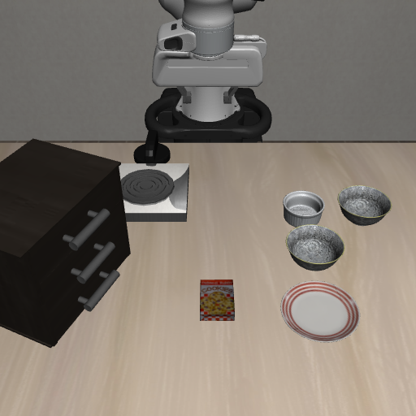

<p align="center">
  
</p>

# 环境适配层

## 项目背景

这个项目用「Agent + 技能库」跑机器人操作任务：Agent 把一句话目标拆成有序子目标，技能库把每个子目标变成机械臂的实际动作。这一篇讲它们脚下的一层——技能与仿真环境之间的环境适配层（`darwin/envs/libero_adapter.py`）。

技能库对外只说两种话：动作（把末端送到某处、夹爪开或合）和查询（这个子目标达成了没有）。仿真环境那边是另一套说法：只接受一个 7 维控制向量——末端三个方向的位移、三个方向的转动，加一路夹爪开合；只用内部状态判断整件事成没成；并对一次任务能走多少步有固定上限。

差异本该在技能里各写各的分支，技能一多就散落着「第几维是绕 x 轴转动」「这个环境怎么判成功」，复用无从谈起。所以我把差异全部收进 `LiberoEnvAdapter`：对上给统一接口，对下用一层壳包住 LIBERO 的仿真。技能库因此不需要知道底下是 robosuite 还是别的仿真器，换后端时执行链的主体不用改一行。

### 整体上的几个取舍

**第一，差异收敛在一层里，不散到每个技能。** 代价是这一层写得厚一点，收益是技能库真能跨环境复用。

**第二，对比实验的前提是起点相同，这件事值得用一点不自然的做法去保证。** 每次复位都从同一条示范轨迹的第一帧开始，看起来有点作弊，换来的是「改动带来的差别」和「噪声带来的差别」可以分开。

**第三，一次任务什么时候算结束由任务条件决定，不由环境数到第几步决定。** 把这件事接过来，上层才有完整的控制权。

**第四，截断要选和负载无关的量。** 用步数而不是实际耗时，「同一个初始状态给出同一个结果」才成立；时间限制留着只防死等。可复现的优先级高于跑得刚好用完所有时间。

**第五，关节目标要留余量。** 打开、关闭这类目标不取范围端点，而取靠边的一点。

### 动作与状态：技能只说「伺服一步」

描述动作只有一种方式：**让末端朝一个目标点伺服一步**，即 `servo_step(site, target, gripper=0.0, k=5.0, vcap=1.0, target_rot=None, kr=5.0)`。伺服的意思是每一步读一次当前状态，只往前修正一点点，不追求一步到位。

位移不直接给，按一阶比例控制现算：`delta = clip(k * (target - 当前位置), -vcap, vcap)`。技能只给终点，走多快由 `vcap` 统一压住；默认增益 `k=5.0`、速度上限 `vcap=1.0`，伺服既跟得上又不会一步跳过去。夹爪统一成 `+1` 闭合、`-1` 张开、`0` 保持，LIBERO 底层正好是同号约定，直接传下去即可。姿态是可选参数：给了 `target_rot` 就按世界坐标系下的轴角误差一起伺服，增益 `kr`；不给就只做位置伺服。

另外留了 `set_nullspace_posture(q_arm)`，用来指定机械臂在任务空间之外那些自由度上的目标关节角，让实际构型跟着关节空间的规划走，减少不该有的擦碰——这是后面调试时才补上的。

读取这一侧同样是统一名字：末端位置用 `get_site_pos`，末端姿态（3×3 旋转矩阵）用 `get_site_rot`，物体位置用 `get_body_pos`（接受任务里的物体名，内部解析到实际几何）；关节角则从 MuJoCo 的模型对象 `mj_model` 里查到该关节在状态数组里的位置，再到数据对象 `mj_data` 里取值。`mj_data` 每次访问返回的都是新对象，**不能存成字段缓存起来**——我一开始为了省一次取值这么做了，结果后面所有读数都冻结在第一次那一刻。

### 子目标与关节类物体怎么查

子目标是否达成分三层查：`check_success()` 问整件事成没成，走环境自己的完成判定；`eval_subgoal(predicate, obj, target)` 按任务定义文件（.bddl 这种文本格式）里同名的一条规则求值，用于逐个核对子目标；柜门、抽屉这类可开合部件用 `fixture_open` / `fixture_close` 单独查。第三条必须存在，因为任务定义文件里有些条件只写了「打开」，并没有单独列成一条规则，用第二种方式查会直接查不到。与其在上层到处写特例，不如在适配层里补一个明确的入口。

开门、拉抽屉、按开关这类动作，上层说的是「打开 xx」，真正执行需要三个量：动哪个关节、现在在什么角度、转到多少才算成。`articulation_info(name)` 一次把这几个量连同关节活动范围一起给出来。关节的找法分两级：先看夹具自己声明的关节名单，名字里带 `top` / `middle` / `bottom` 的用来区分上下多个抽屉；名单是空的，就退回模型里以夹具名为前缀的那个关节。

目标角度不取活动范围的端点，而取范围内部靠边的一点：打开取靠近下界的 20% 处，关闭取靠近上界的 80% 处。环境自己的判定阈值本来就压在范围端点上，取内部点既能稳定满足条件，又给物理漂移留了余量。开关类的方向还相反，它的判定阈值在下界一侧，所以按 20% 那侧取值。

### 固定初始状态：让前后对比有意义



*回合开始时的画面：每次尝试都从这个固定初始状态出发。*


所有尝试都从同一条示范轨迹的初始状态开始：每次复位先做环境的常规复位，再把状态设成该任务第一条示范轨迹的第一个状态（`reset()` 里的 `set_init_state`）。这个项目最常做的事是「改一个东西、看结果变没变」，如果每次初始摆放都是随机的，前后的差别就说不清是改动带来的还是运气带来的。复位时顺手记下开局的末端位置，供「回到安全位」这类动作用；需要回放示范动作时，另有 `demo_actions(suite, idx)` 可以读出对应序列。

### 不让环境把任务提前掐断

环境自己数着步数，默认数到 1000 个控制步就把结束标志置真，但这里的执行链是自己决定走多少步的：一条轨迹跑多少步，由子目标有没有达成决定。技能里较长的搬运段单独就可能跑 500 步以上，加上移动、下压、抬升，很容易越过 1000 步。

我一开始让技能在超限后自己重新开头，结果实验跑到一半就被环境打断。改成在 `step()` 里把内层计数器清零再继续，同时把环境给出的结束标志只当「计数器到点了」，不当作任务结束。清零有个实现细节：环境外面套的那层壳只把属性的读取转发进来、不转发写入，所以直接在最外层赋值只会写在那层壳上，`_rewind_inner_timestep` 必须一层一层往里走，找到真正的环境对象再赋值。

### 用仿真步数而不是实际耗时做截断

每条轨迹都要有上限，否则一次跑飞可能耗掉一整轮实验，上限到点用异常 `AttemptStepLimit` 中断执行。

上限按仿真步数算，不按实际耗时算。实际耗时随机器负载变化，同一个初始状态在机器忙时和闲时会在不同位置被截断，基准结果就不可复现；步数则与负载无关，同一初始状态一定走到同一个地方。默认上限 7000 步，大约是已观测最长一次尝试的四倍多，正常负载下会先于时间限制触发。

这个异常继承的是 `BaseException` 而不是普通的 `Exception`。技能层里有不少 `except Exception` 用来处理一般的技能失败（换抓取候选、重规划），而「这条轨迹的步数用完了」是更高一层的信号，必须穿过这些处理直接到最外层的执行器，否则会被当成一次普通技能失败吞掉，丢掉「这条轨迹作废」这个意思。

实际耗时作为一条备用限制保留，默认 300 秒，只在进程卡住、步数根本没往前走的时候才可能先触发，两个上限谁先到谁生效。上限由执行器在每次尝试开始时设置（命令行参数 `--attempt-steps`，0 表示不限），同时按尝试序号给感知用到的随机数发生器重新播种——这样同一次尝试内部结果一致，不同尝试之间仍保留差异。

### 环境创建与缓存

环境用一个字符串标识，格式是 `libero:<suite>:<任务序号>`，比如 `libero:libero_spatial:0`，由 `parse_env_id` 解析。缓存分两层：任务元信息（任务定义文件路径、示范数据路径、示范初始状态、示范动作条数）用 `lru_cache` 只留最近 8 个任务，避免反复读数据文件；环境实例本身在 `agents/env_utils.py` 的 `get_env` 里按任务缓存，同一个任务重复跑不会反复加载模型。

任务集没有做成静态清单——LIBERO 的任务太多，写死很难维护。改由 `benchmarks/__init__.py` 的 `get_libero_benchmark(suite, task_idx)` 在需要时动态生成一条任务条目，带上环境标识、任务的自然语言描述和目标信息。

相机分辨率默认 128 像素，构造时可以改；仿真步长 0.002 秒、控制频率 20 Hz（每个动作推进 0.05 秒）是底层默认值，适配层不动它。

```bash
PYTHONPATH=$PWD:/path/to/LIBERO python -m darwin.agents.libero_runner \
    --tasks libero_spatial:0 --max-attempts 8 --attempt-steps 7000
```

以库的方式用时，先 `LiberoEnvAdapter(suite, task_idx)` 建环境，`reset()` 之后循环调 `servo_step`，用 `get_site_pos` / `eval_subgoal` / `check_success` 观察状态；环境已经由执行器建好时，用 `darwin.agents.env_utils.get_env("libero:libero_spatial:0", "libero_panda")` 直接取缓存实例，不要重复创建。

## 调试过程中踩过的问题

**第一是「省一次取值」导致的静默错误。** 就是前面把 `mj_data` 缓存下来的那次，读数全部冻结。它不报错，只是所有观测都不再变化，看上去像仿真卡住了。文档里说「每次拿到的都是新对象」的时候，要当真。

**第二是任务被环境提前掐断。** 表现为长搬运段跑到一半就终止，定位之后发现是环境自己的计数器到点，跟任务条件无关。解决办法就是把它清零，并且明确结束标志不等于任务结束。

**第三是属性写入被外面那层壳吃掉。** 我明明把计数器清零了，行为却一点没变。原因是那层壳只把读取转发进来、不把写入转发进去，赋值落在了壳上。这个坑不去查它的实现是看不出来的，只能一层一层往里走到底再赋值。

**第四是关节目标角度取错了侧。** 开关类动作我把目标取到范围的上界一侧，结果动作幅度是判定阈值的三倍多，机械臂甩得很大还常常失败。回头去看环境自己的判定条件，才发现它的阈值就压在另一侧，目标只要略越过那一侧即可。
