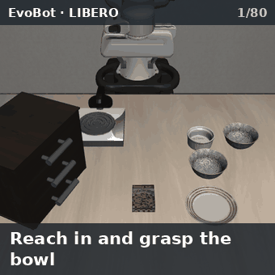
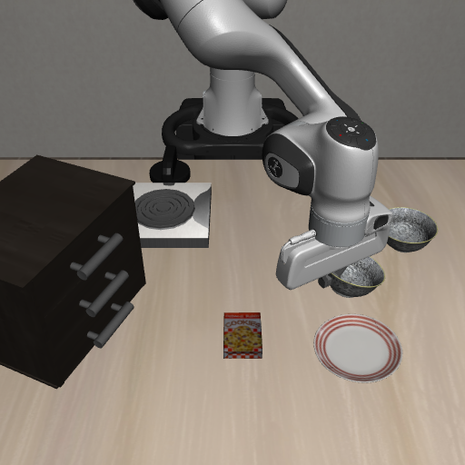

  

# 逆运动学、末端伺服与运动控制

**Agent + Skill：Agent 决定做什么、按什么顺序做，技能库负责执行**

在 [LIBERO](https://github.com/Lifelong-Robot-Learning/LIBERO) 基准的 30 个任务上经过多轮迭代，成功率 **83%（25 / 30）**。

不用强化学习 · 不用视觉-语言-动作模型 · 不用世界模型 · 运行时不需要调用大模型

  
   
  一个完整回合：抓起黑碗，放到盘子上（LIBERO <code>libero_spatial:0</code>，第 1 次尝试成功，2965 个仿真步）

---

## 项目背景

这个项目做的是机械臂的抓取与放置任务：给一句话描述的目标，让它自己拆成动作序列做出来。分工是「Agent + 技能库」——Agent 决定做什么、按什么顺序做，技能负责把每个动作真正执行完。

我讲的是技能库最底下那一层。不管上层技能叫悬停、下降还是放置，最后都要落到同一件事上：**把机械臂末端动到某个位姿**。拆开看里面是三件不同的事：逆运动学回答"够不够得到"，伺服回答"够得准不准"，运动控制回答"怎么过去"。它们的时机不一样——逆解是事前算一次，伺服是贴着物理状态反复纠正，运动控制夹在中间，决定前两者怎么接上。

先把几个词交代清楚：逆运动学是把正运动学反过来，给末端位置算关节角；雅可比是"每个关节转一点、末端跟着动多少"的矩阵；伺服是不追求一步到位，每步读一次当前状态、每次只修正一点点。

## 整体上的几个取舍

**第一，把"算"和"执行"分开。** 逆解只在规划侧算一次，执行侧交回控制器闭环。自己解出来的关节角会绕开控制器的零空间处理，和规划的构型分叉；分开之后两边各自做擅长的事，再用零空间姿态锚定把两个构型绑在一起。

**第二，到位用残差容差，不用固定步数。** 控制器有稳态偏置，误差不会真的到零。用"误差进入噪声带"作标准更贴近物理，也不会出现"还差几毫米就放弃"和"白等几百步"这两种浪费。

**第三，不设预测的步数预算。** 进展慢但确实在前进的动作必须走完，砍掉它就是把马上要发生的接触事件截断。终止交给统计和物理证据，不交给事先猜出来的数字。

**第四，规划、执行、碰撞检查用同一套精度。** 规划时的点距、执行时的点距、碰撞检查的细分是同一个数值。规划时没事、执行时擦到，根源几乎总是在两边精度不一致。

**第五，冗余手臂要遍历解，不能只取最优解。** "够得到"和"不撞"必须落在同一个解上，只看残差最小的那个，等于默认它一定能用，而实际经验恰恰相反。

## 逆运动学：把位姿解成关节角

逆解只在规划、候选筛选和可达性检查时被调用；真正的执行路径不自己解 IK，而是把末端位姿增量交给仿真环境里的操作空间控制器（robosuite 的 OSC），由它内部完成换算。原因是 7 自由度手臂在末端任务之外还有富余自由度，控制器默认把这些多余自由度拉回初始构型，而我自己规划的构型是另一个分支，两边不一致就表现成"规划时明明绕开了、执行时却擦碰"。所以规划侧负责算出无碰撞构型，执行侧仍走 OSC 的速度指令，另外把零空间姿态目标锚到当前规划点上，让物理构型和规划构型跟着同一个目标走。

求解我选的是**阻尼最小二乘（DLS）迭代**。每一轮先取末端抓取点的位置雅可比，需要姿态时再叠加旋转雅可比，然后解 `dq = Jᵀ (J Jᵀ + λ²I)⁻¹ e`，其中 `e` 是当前的位姿误差，λ 取 0.05。7 自由度做 6 维位姿解算是冗余的，解析解要么不通用、要么要处理一堆分支；朴素的伪逆则在手臂接近伸直、也就是接近奇异位形时，会算出一个特别大的关节增量，一步就把构型甩飞。加那个 λ²I 就是为了这时候把解压小——宁可这一步慢一点，也不要抖出去。解出的增量再按模型里每个关节的上下限逐关节截断。

迭代最多 80 轮，位置误差小于 3 毫米就提前退出，带姿态时还要姿态误差小于约 0.05 弧度。整个过程跑在一份**独立的模型数据副本**上，不扰动正在运行的仿真状态，因为规划随时可能在 episode 中途被调用。

这个接口返回的是**残差**，而不是"成功/失败"：解出的关节角、位置残差（米），带姿态时再给姿态残差（弧度），既不抛异常也不返回布尔值。调用方拿残差和容差一比就能自己下结论：容差内视为够得到；超出就是目标位姿不可达，上层按"目标点不在工作空间或被障碍楔住"这类失败上报，并把目标点、当前末端、残差和接触力一起带上。也就是说求解过程里没有一条独立的失败分支，够不到不是异常，而是规划必须处理的一个正常分支，用返回值表达比用异常表达更容易组合。

单次 DLS 只保证局部收敛，而 7 自由度手臂是冗余的，同一个末端位姿可以有多种肘部朝向。第一个解很可能落在不合适的分支上：比如沿手臂伸展方向的那个解，够是够得到，但前臂会横扫旁边的物体。

所以我在外面套了两个函数：一个做 6 次热启动，第一次用当前关节角作起点，之后用随机采样的构型以及"当前构型和随机构型之间的插值"作起点，最后取残差最小的那个解；另一个把**全部容差内的解**逐个枚举出来。规划终点用后者，而且重启次数放大到 24 次。

原因是终点要同时满足"够得到"和"不撞"，而这两个条件必须落在**同一个解**上：首个收敛解经常是伸展分支，被碰撞检查拒掉之后，换一个肘部方向的解可能就是无碰撞的，所以过滤的一方应该遍历多个解，而不是只看最优的那一个。随机序列用固定种子，同一个输入的结果可重复。

## 伺服：闭环怎么把误差磨掉

*第 1450 步：抓取结束，机械臂开始把碗搬向盘子。*

统一入口是 `servo_step`：读当前末端位置，算出与目标的差值，乘一个比例增益，再按上限截断，得到本步的位移增量。例行段用 5.0 的增益，最后一段精细收敛降到 2.5，限幅用 1.0。这里有个取舍值得说明：那个上限是按"米每秒"来理解的，但代码里它实际就是**单步位移的截断值**，因为仿真的一步对应固定时长。把速度上限实现成位移上限，好处是它天然和碰撞监测配合——单步位移被限住之后，监测才能在"已经看得很近"的时候中止，而不是一步跨进去；代价是同一个数值在不同控制频率下含义会变。我接受这个代价，因为这个项目只有两个固定步长的环境。

到位判定有两种。调用方给了几何复验函数时按它判定，比如 `goto` 传了 `tol`，就构造一个"末端与目标距离不超过 tol"的复验。没有复验函数时，要求位置残差小于「3 毫米和 3 倍标准差里较大的那个」，**并且**姿态残差不超过约 0.05 弧度；这里的标准差是最近 30 步窗口里误差的实测波动，也就是"进入测量噪声范围就算到了"。

固定步数在这个问题上没有物理意义：控制器稳态本身就有几毫米的跟踪偏置，误差永远不会真的变成零，步数定少了会在还差几毫米的时候提前放弃，定多了就是白等。用残差作标准的含义是"再等等也不会更好"，这和物理是一致的。

没有进展的时候，要靠物理证据分类。每 30 步做一次窗口回归，拟合误差随时间的变化斜率；斜率不够显著（t 统计量低于 2），或者窗口里的闭合距离不足 0.75 毫米，就记一次停滞。连续 3 个停滞窗口之后，再按物理证据分类：接触力超过平时水平 3 倍标准差的，是有东西真的挡住了；臂关节几乎不动的，是到头了或者被楔住了。这里不设预测的步数预算的理由前面已经说过——真该终止的情况交给这套统计分类去判。

代码里仍然保留了一个 `budget` 参数，但它只留给调用方做硬性的资源限制，不是默认行为。

`servo_step` 也支持姿态伺服：给一个目标旋转矩阵和旋转增益，位置和姿态就一起伺服。姿态误差用世界系轴角表示（三个坐标轴叉积之和的一半），和旋转雅可比处在同一个坐标系里，也就和 OSC"左乘期望旋转"的约定对得上。在最后闭环那一层，我还会把姿态误差乘上实测的指尖杠杆臂换算成米，让它和位置误差在同一个量纲下比较。

## 运动控制：路径与速度

`plan_arm_path` 用的是 **RRT-Connect 双树采样**，直接在关节空间找一条无碰撞路径。距离度量用关节行程归一化之后的欧氏距离，扩展步长 0.15，节点上限 6000。终点由 6D 逆解给出：位置残差不超过 3 毫米、姿态残差不超过 0.05 弧度，而且自身无碰撞；目标姿态缺省取当前末端姿态，也就是锁定姿态。找到路径之后做最多 80 次短路平滑——两个点之间如果能直线直达，就把中间的点剪掉。

这里有一个具体的坑：**碰撞检测的细分精度必须和执行时的细分精度一致**，两边都用 0.003（归一化关节行程），不一致就会出现"规划时说无碰撞、执行时擦到了"，因为规划只检查了稀疏的点，中间那段没人看。

执行时 `execute_arm_path` 把路径按 0.003 再细分一遍，逐点做前向运动学，然后边执行边过**跟踪门**：真实的末端必须走到当前目标点附近，门槛取相邻两点间距的两倍和 3 毫米里的较大者，才允许继续往前进。每个门还要在**真实物理状态**上重算一次碰撞，而不是相信规划时的构型。

非严格模式的最后一个点会把门槛放宽到控制器稳定跟踪时那点偏差的范围，把剩下几毫米的残差交给后续的事件驱动原语去消除；严格模式则用精细增益收敛到精确容差。

速度这一层目前只有**每步位移上限**：LIBERO 默认 1.0，也就是控制器全量程；每个任务各自覆盖，实际用到的下限到 0.53 左右；搬运和放置分别限到 0.05，推动类原语用 0.3。加速度与加加速度的上限**当前没有实现**，运动的平滑程度由路径点的细分密度和每步限幅间接决定。

这是我的一个明确取舍：这套系统跑的是仿真，物理步长固定、单步位移本来就被限住，先加上加速度约束收益不大；真要上真机，这一层是必须补的。同样的理由，LIBERO 的执行路径里也没有关节力矩上限和末端接触力上限，伺服的停止靠的是残差收敛和停滞分类，而不是"力超过某个值就停"。配置里那些力、刚度、阻尼字段来自另一套面向刚度阻尼控制的原语，LIBERO 的技能并不使用它们。

通用路径规划走的是另一条更通用的路：`PathPlanSkill` 把规划下沉到环境后端，由后端用现成的库（mplib 的 RRT-Connect 加 FCL 碰撞检测）规划，输出关节角序列，然后以准静态方式逐点设置关节角执行——刻意跳过控制器，因为让控制器重解一次逆解会把已经避开障碍的构型解掉。后端没有注入时它返回一个明确的"规划器不可用"，而不是让程序崩掉。

技能层统一调用 `servo_step`，从来不直接调环境的 `step`。LIBERO 这侧的最终入口是适配器的 `servo_step`：把目标位置换算成增量并限幅，带上姿态修正和夹爪指令，打包成七维动作（三个位置量、三个姿态量、一个夹爪量）发给 OSC；episode 的步数用尽时抛一个专门的异常，让技能干净退出，而不是继续发无效动作。通用那一层负责分派：环境自己实现了就委托过去，否则按环境类型构造动作，并且把"闭合为正、张开为负"的统一夹爪约定翻译成各环境自己的物理极性。适配层还提供 `set_nullspace_posture`，在不改变末端任务目标的前提下，把未被约束的关节自由度拉到指定构型，这就是前面说的让物理构型和规划构型保持一致的那一招。

## 调试过程中踩过的问题

**第一个是"到位了"和"真的到位了"不是一回事。** 下降动作一度只要 z 方向到位就判成功，结果好几次末端在 z 上到了、xy 上却漂了两三厘米，直接合爪就是夹空，后面提起来才发现什么都没抓到。这是控制器的实际构型和期望构型有偏差造成的。修法是加一道 xy 守卫：z 到位而且 xy 偏差也收敛，才算真的到位。

**第二个是停滞检测的窗口太短会误杀。** 我一开始用一个 30 步的窗口判定"没有进展"，结果发现在关节限位边缘附近的下降本来就慢，一个窗口够不到进展阈值，于是被判成卡住、提前合爪——事后量了一下，当时离目标只差 8 毫米。改成连续两个窗口确认（也就是 60 步）才动手，这类误判就没有了。

**第三个是"停住了"不等于"被挡住了"。** 有一次末端停在半空不动，接触力几乎是零，但它确实已经到不了更低的位置了——那是控制器的可达极限，不是几何阻挡。这两种情况的处理方式完全不同，所以我在停滞分类里加了一条：在目标上方的接受带内、xy 已收敛、并且接触力接近零时，接受这个位置作为到位。判断依据是三条同时成立，缺一不可。

**第四个是路径规划的失败不一定是真的不可达。** 采样规划是概率完备的，同一个种子下同一次搜索恰好失败，只是这次搜索的伪影，不是"这条路不存在"的证据。所以我把采样序列做成有种子可复现的，同时把"换个种子重试"作为标准恢复手段。

**第五个是走直线看似最省事。** 悬停动作最初就是先竖直抬升、再水平平移，结果在某些场景里会贴着柜顶磨过去、磨到卡停。后来给水平段加了一层障碍检查，会和障碍相交时就改成飞越或者插一个侧向绕点。
